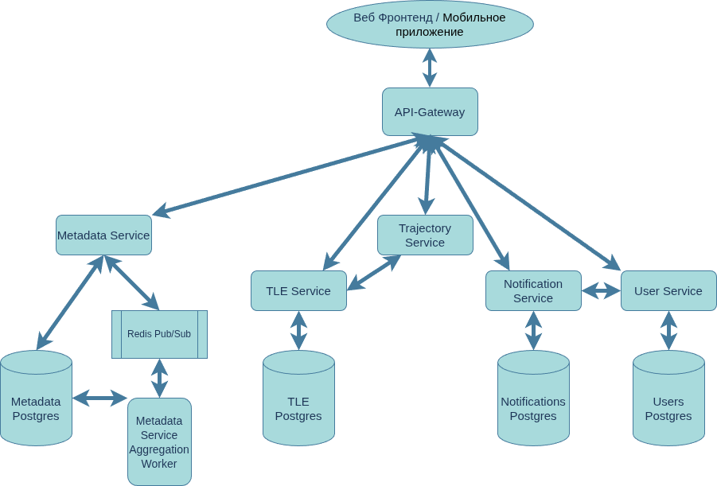

# Orbitalik

## Описание проекта

Orbitalik — это платформа для работы с информацией об искусственных спутниках Земли, предназначенная для получения
данных об орбитах, расчёта траекторий движения спутников и уведомления пользователей о пролетах спутников в их поле зрения.

Проект объединяет в себе несколько ключевых возможностей: хранение данных о спутниках, вычисление положения космических
объектов и систему пользовательских уведомлений.

Основная идея Orbitalik — предоставить единый инструмент для удобного доступа к спутниковым данным без необходимости использовать множество разрозненных сервисов.

---

# Актуальность проекта

Количество искусственных спутников на орбите Земли постоянно увеличивается. Сегодня существуют десятки различных источников информации о космических объектах, однако эти данные часто разделены между разными платформами:

- каталоги спутников;
- базы орбитальных параметров;
- сервисы расчёта траекторий;
- системы уведомлений.

Из-за этого пользователю приходится использовать несколько инструментов одновременно для получения полной информации о спутнике.

Orbitalik решает эту проблему, объединяя основные функции спутникового мониторинга в единую систему.

---

# Цель проекта

Создание масштабируемой платформы для получения, обработки и предоставления информации об искусственных спутниках Земли.

Основные задачи проекта:

- хранение информации о спутниках;
- работа с орбитальными параметрами;
- расчёт положения и траекторий спутников;
- определение периодов видимости спутников;
- предоставление уведомлений пользователям.

---

# Основные возможности

## Работа с информацией о спутниках

Система предоставляет структурированную информацию о космических объектах:

- идентификаторы спутников;
- характеристики миссии;
- основные параметры;
- связанные орбитальные данные.

Это позволяет быстро получать информацию о нужном объекте и использовать её в дальнейших вычислениях.

---

## Управление орбитальными данными

Для описания движения спутников используются данные TLE (Two-Line Element).

Модуль работы с TLE отвечает за:

- хранение орбитальных параметров;
- получение актуальных данных;
- передачу информации в систему расчёта траекторий.

TLE являются основой для прогнозирования движения спутников.

---

## Расчёт траекторий спутников

Одной из ключевых возможностей Orbitalik является вычисление движения спутников.

Система позволяет:

- определить текущее положение спутника;
- построить траекторию движения;
- рассчитать параметры наблюдения;
- определить ближайшие пролёты спутника над заданной точкой.

Таким образом, пользователь может узнать, где находится спутник и когда он будет доступен для наблюдения.

---

## Система уведомлений

Orbitalik содержит механизм подписок и уведомлений.

Пользователи могут:

- создавать подписки на события;
- регистрировать устройства;
- получать уведомления о предстоящих событиях.

Система может сообщить пользователю о приближающемся пролёте выбранного спутника.

---

# Архитектура системы



Orbitalik построен на основе микросервисной архитектуры.

Взаимодействие компонентов осуществляется через gRPC-интерфейсы, описанные с помощью Protocol Buffers.

Система состоит из следующих сервисов:

- User Service;
- Satellite Metadata Service;
- TLE Service;
- Trajectory Service;
- Notification Service.

Каждый сервис отвечает за отдельную область функциональности, что позволяет независимо развивать и масштабировать компоненты системы.

---

# Компоненты системы

## User Service

Сервис управления пользователями.

**Язык реализации: Go**

Основные функции:

- создание пользователей;
- получение информации о пользователях;
- изменение пользовательских данных;
- управление пользовательскими сущностями.

Сервис предоставляет отдельный gRPC API, описанный через Protocol Buffers, что обеспечивает строгую типизацию запросов и ответов.

---

## Satellite Metadata Service

Сервис хранения информации о спутниках.

**Язык реализации: Go**

Отвечает за:

- Сбор данных из открытых источников интернета (USC, Celestrak, Satdump и т.д.);
- Агрегация данных;
- хранение каталожных данных;
- предоставление информации другим компонентам системы.

Сервис используется для получения дополнительных характеристик космических объектов и связывает метаданные спутников с их орбитальными параметрами.

---

## TLE Service

Сервис управления орбитальными параметрами.

**Язык реализации: Go**

Основные функции:

- получение орбитальной информации;
- хранение TLE-данных;
- предоставление данных для расчёта движения.

Сервис является источником актуальных орбитальных параметров для вычислительных модулей системы.

---

## Trajectory Service

Главный вычислительный компонент системы.

**Язык реализации: Rust**

Отвечает за:

- расчёт текущего положения спутника;
- построение траекторий;
- вычисление видимости;
- прогнозирование будущих пролётов.

Для работы сервис использует данные орбитальных параметров из TLE Service.

Trajectory Service выполняет основные вычислительные операции, связанные с обработкой орбитальной информации и прогнозированием движения спутников.

---

## Notification Service

Сервис пользовательских уведомлений.

**Язык реализации: Python**

Основные функции:

- управление подписками;
- регистрация устройств;
- отправка уведомлений о событиях.

Сервис взаимодействует с другими компонентами системы для получения информации о событиях и подготовки уведомлений для пользователей.

---

# Пример работы системы

## Получение информации о ближайшем пролёте спутника

1. Пользователь отправляет запрос на получение информации о пролётах спутника.
2. Trajectory Service принимает запрос.
3. Сервис получает необходимые орбитальные параметры из TLE Service.
4. Выполняется расчёт траектории движения.
5. Пользователь получает информацию о времени и параметрах пролёта.

---

# Преимущества архитектуры

## Разделение ответственности

Каждый сервис отвечает только за свою область, что упрощает разработку и поддержку.

## Масштабируемость

Компоненты системы могут развиваться и масштабироваться независимо друг от друга.

## Расширяемость

В будущем можно добавлять новые возможности:

- новые источники спутниковых данных;
- дополнительные методы прогнозирования;
- веб- и мобильные приложения;
- расширенные функции наблюдения.

## Надёжность

Использование отдельных сервисов уменьшает влияние ошибок одного компонента на всю систему.

---

# Перспективы развития

В дальнейшем Orbitalik может быть расширен следующими возможностями:

- поддержка реального времени;
- создание пользовательского веб-интерфейса;
- мобильное приложение;
- автоматическое планирование наблюдений.

---

# Заключение

Orbitalik представляет собой современную платформу для работы со спутниковыми данными, объединяющую хранение информации о космических объектах, обработку орбитальных параметров, расчёт траекторий и систему уведомлений.

Использование микросервисной архитектуры, языка Go и gRPC позволяет создать гибкую и масштабируемую основу для дальнейшего развития системы и применения в задачах спутникового мониторинга.

---

# Запуск проекта

Для запуска Orbitalik необходимо выполнить несколько подготовительных шагов.

## Предварительные требования

Перед запуском убедитесь, что на компьютере установлены:

- Docker;
- Docker Compose;
- GNU Make.

---

## 1. Клонирование репозитория

```bash
git clone https://github.com/SteeperMold/Orbitalik.git
cd Orbitalik
```
---

## 2. Создание файлов конфигурации

Каждый сервис использует собственный файл конфигурации `.env`.

Необходимо рекурсивно скопировать все файлы `.env.example` в соответствующие `.env`.

Для Linux/macOS:

```bash
find . -name ".env.example" -exec sh -c 'cp "$1" "${1%.example}"' _ {} \;
```

Для Windows PowerShell:

```powershell
Get-ChildItem -Recurse -Filter ".env.example" | ForEach-Object {
    Copy-Item $_.FullName ($_.FullName -replace '\.example$','')
}
```

При необходимости значения в созданных `.env` файлах можно изменить под своё окружение.

---

## 3. Запуск проекта

После подготовки конфигурации достаточно выполнить:

```bash
make run-dev
```

или, если требуется запуск напрямую через Docker Compose:

```bash
docker compose up --build
```

---

## 4. Остановка проекта

Для остановки всех сервисов выполните:

```bash
make down
```

или

```bash
docker compose down
```